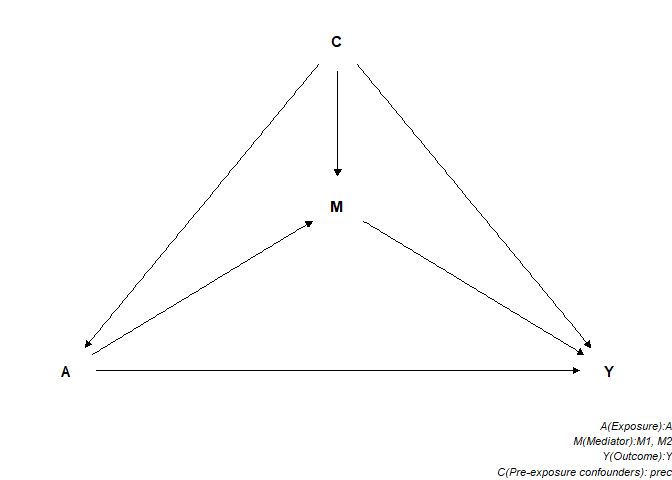
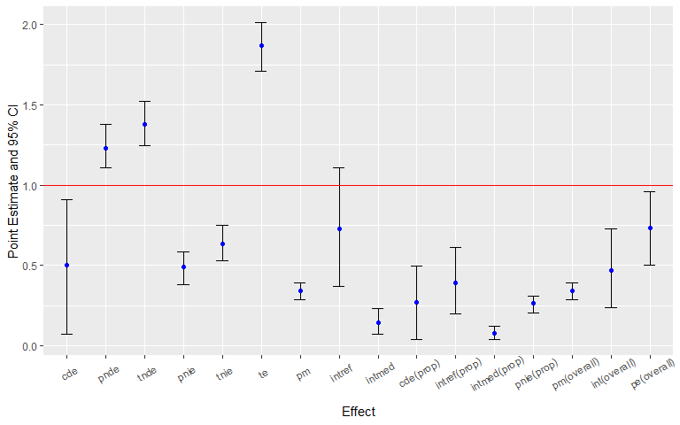
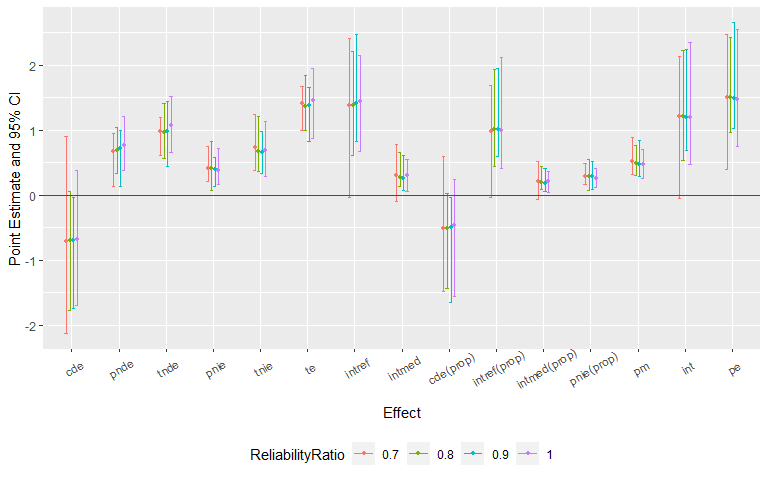
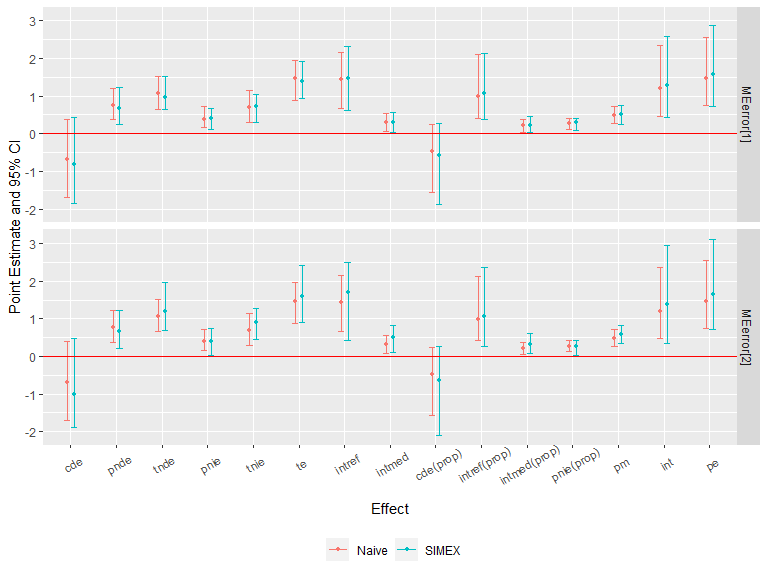

About the Package
=================

The R package `CMAverse` provides a suite of functions conducting causal
mediation analysis including `cmdag` for DAG visualization, `cmest` for
statistical modeling and `cmsens` for sensitivity analysis.

DAG Visualization
-----------------

`cmdag` visualizes the scientific setting via a DAG.

Statistical Modeling
--------------------

`cmest` implements six causal mediation analysis approaches including
*the regression-based approach* by [Valeri et
al. (2013)](https://www.ncbi.nlm.nih.gov/pmc/articles/PMC3659198/) and
[Vanderweele et
al. (2014)](https://www.ncbi.nlm.nih.gov/pmc/articles/PMC4287269/), *the
weighting-based approach* by [Vanderweele et
al. (2014)](https://www.ncbi.nlm.nih.gov/pmc/articles/PMC4287269/), *the
inverse odd-ratio weighting approach* by [Tchetgen Tchetgen et
al. (2013)](https://www.ncbi.nlm.nih.gov/pmc/articles/PMC3954805/), *the
natural effect model* by [Vansteelandt et
al. (2012)](https://www.degruyter.com/view/journals/em/1/1/article-p131.xml?language=en),
*the marginal structural model* by [VanderWeele et
al. (2009)](https://pubmed.ncbi.nlm.nih.gov/19234398), and *the
g-formula approach* by [Lin et
al. (2017)](https://www.ncbi.nlm.nih.gov/pmc/articles/PMC5285457/).

<table>
<caption>Supported Data Types and Functionalities of <code>cmest</code></caption>
<thead>
<tr class="header">
<th></th>
<th style="text-align: center;">rb</th>
<th style="text-align: center;">wb</th>
<th style="text-align: center;">iorw</th>
<th style="text-align: center;">ne</th>
<th style="text-align: center;">msm</th>
<th style="text-align: center;">gformula<a href="#fn1" class="footnote-ref" id="fnref1" role="doc-noteref">1</a></th>
</tr>
</thead>
<tbody>
<tr class="odd">
<td>Continuous Y<a href="#fn2" class="footnote-ref" id="fnref2" role="doc-noteref">2</a></td>
<td style="text-align: center;">√</td>
<td style="text-align: center;">√</td>
<td style="text-align: center;">√</td>
<td style="text-align: center;">√</td>
<td style="text-align: center;">√</td>
<td style="text-align: center;">√</td>
</tr>
<tr class="even">
<td>Binary Y</td>
<td style="text-align: center;">√</td>
<td style="text-align: center;">√</td>
<td style="text-align: center;">√</td>
<td style="text-align: center;">√</td>
<td style="text-align: center;">√</td>
<td style="text-align: center;">√</td>
</tr>
<tr class="odd">
<td>Count Y</td>
<td style="text-align: center;">√</td>
<td style="text-align: center;">√</td>
<td style="text-align: center;">√</td>
<td style="text-align: center;">√</td>
<td style="text-align: center;">√</td>
<td style="text-align: center;">√</td>
</tr>
<tr class="even">
<td>Nominal Y</td>
<td style="text-align: center;">√</td>
<td style="text-align: center;">√</td>
<td style="text-align: center;">√</td>
<td style="text-align: center;">×</td>
<td style="text-align: center;">√</td>
<td style="text-align: center;">√</td>
</tr>
<tr class="odd">
<td>Ordinal Y</td>
<td style="text-align: center;">√</td>
<td style="text-align: center;">√</td>
<td style="text-align: center;">√</td>
<td style="text-align: center;">×</td>
<td style="text-align: center;">√</td>
<td style="text-align: center;">√</td>
</tr>
<tr class="even">
<td>Survival Y</td>
<td style="text-align: center;">√</td>
<td style="text-align: center;">√</td>
<td style="text-align: center;">√</td>
<td style="text-align: center;">×</td>
<td style="text-align: center;">√</td>
<td style="text-align: center;">√</td>
</tr>
<tr class="odd">
<td>Continuous M</td>
<td style="text-align: center;">√</td>
<td style="text-align: center;">√</td>
<td style="text-align: center;">√</td>
<td style="text-align: center;">√</td>
<td style="text-align: center;">×</td>
<td style="text-align: center;">√</td>
</tr>
<tr class="even">
<td>Binary M</td>
<td style="text-align: center;">√</td>
<td style="text-align: center;">√</td>
<td style="text-align: center;">√</td>
<td style="text-align: center;">√</td>
<td style="text-align: center;">√</td>
<td style="text-align: center;">√</td>
</tr>
<tr class="odd">
<td>Nominal M</td>
<td style="text-align: center;">√</td>
<td style="text-align: center;">√</td>
<td style="text-align: center;">√</td>
<td style="text-align: center;">√</td>
<td style="text-align: center;">√</td>
<td style="text-align: center;">√</td>
</tr>
<tr class="even">
<td>Ordinal M</td>
<td style="text-align: center;">√</td>
<td style="text-align: center;">√</td>
<td style="text-align: center;">√</td>
<td style="text-align: center;">√</td>
<td style="text-align: center;">√</td>
<td style="text-align: center;">√</td>
</tr>
<tr class="odd">
<td>Count M</td>
<td style="text-align: center;">√</td>
<td style="text-align: center;">√</td>
<td style="text-align: center;">√</td>
<td style="text-align: center;">√</td>
<td style="text-align: center;">×</td>
<td style="text-align: center;">√</td>
</tr>
<tr class="even">
<td>M of Any Type</td>
<td style="text-align: center;">×</td>
<td style="text-align: center;">√</td>
<td style="text-align: center;">√</td>
<td style="text-align: center;">√</td>
<td style="text-align: center;">×</td>
<td style="text-align: center;">×</td>
</tr>
<tr class="odd">
<td>Continuous A</td>
<td style="text-align: center;">√</td>
<td style="text-align: center;">×<a href="#fn3" class="footnote-ref" id="fnref3" role="doc-noteref">3</a></td>
<td style="text-align: center;">×</td>
<td style="text-align: center;">√</td>
<td style="text-align: center;">×<a href="#fn4" class="footnote-ref" id="fnref4" role="doc-noteref">4</a></td>
<td style="text-align: center;">√</td>
</tr>
<tr class="even">
<td>Binary A</td>
<td style="text-align: center;">√</td>
<td style="text-align: center;">√</td>
<td style="text-align: center;">√</td>
<td style="text-align: center;">√</td>
<td style="text-align: center;">√</td>
<td style="text-align: center;">√</td>
</tr>
<tr class="odd">
<td>Nominal A</td>
<td style="text-align: center;">√</td>
<td style="text-align: center;">√</td>
<td style="text-align: center;">√</td>
<td style="text-align: center;">√</td>
<td style="text-align: center;">√</td>
<td style="text-align: center;">√</td>
</tr>
<tr class="even">
<td>Ordinal A</td>
<td style="text-align: center;">√</td>
<td style="text-align: center;">√</td>
<td style="text-align: center;">√</td>
<td style="text-align: center;">√</td>
<td style="text-align: center;">√</td>
<td style="text-align: center;">√</td>
</tr>
<tr class="odd">
<td>Count A</td>
<td style="text-align: center;">√</td>
<td style="text-align: center;">×<a href="#fn5" class="footnote-ref" id="fnref5" role="doc-noteref">5</a></td>
<td style="text-align: center;">×</td>
<td style="text-align: center;">√</td>
<td style="text-align: center;">×<a href="#fn6" class="footnote-ref" id="fnref6" role="doc-noteref">6</a></td>
<td style="text-align: center;">√</td>
</tr>
<tr class="even">
<td>Multiple Mediators</td>
<td style="text-align: center;">√</td>
<td style="text-align: center;">√</td>
<td style="text-align: center;">√</td>
<td style="text-align: center;">√</td>
<td style="text-align: center;">√</td>
<td style="text-align: center;">√</td>
</tr>
<tr class="odd">
<td>Post-exposure Confounding</td>
<td style="text-align: center;">×</td>
<td style="text-align: center;">×</td>
<td style="text-align: center;">×</td>
<td style="text-align: center;">×</td>
<td style="text-align: center;">√</td>
<td style="text-align: center;">√</td>
</tr>
<tr class="even">
<td>2-way Decomposition</td>
<td style="text-align: center;">√</td>
<td style="text-align: center;">√</td>
<td style="text-align: center;">√</td>
<td style="text-align: center;">√</td>
<td style="text-align: center;">√</td>
<td style="text-align: center;">√</td>
</tr>
<tr class="odd">
<td>4-way Decomposition</td>
<td style="text-align: center;">√</td>
<td style="text-align: center;">√</td>
<td style="text-align: center;">×</td>
<td style="text-align: center;">√</td>
<td style="text-align: center;">√</td>
<td style="text-align: center;">√</td>
</tr>
<tr class="even">
<td>Estimation: Closed-form Parameter Function</td>
<td style="text-align: center;">√<a href="#fn7" class="footnote-ref" id="fnref7" role="doc-noteref">7</a></td>
<td style="text-align: center;">×</td>
<td style="text-align: center;">×</td>
<td style="text-align: center;">×</td>
<td style="text-align: center;">×</td>
<td style="text-align: center;">×</td>
</tr>
<tr class="odd">
<td>Estimation: Direct Counterfactual Imputation</td>
<td style="text-align: center;">√</td>
<td style="text-align: center;">√</td>
<td style="text-align: center;">√</td>
<td style="text-align: center;">√</td>
<td style="text-align: center;">√</td>
<td style="text-align: center;">√</td>
</tr>
<tr class="even">
<td>Inference: Delta Method</td>
<td style="text-align: center;">√<a href="#fn8" class="footnote-ref" id="fnref8" role="doc-noteref">8</a></td>
<td style="text-align: center;">×</td>
<td style="text-align: center;">×</td>
<td style="text-align: center;">×</td>
<td style="text-align: center;">×</td>
<td style="text-align: center;">×</td>
</tr>
<tr class="odd">
<td>Inference: Bootstrapping</td>
<td style="text-align: center;">√</td>
<td style="text-align: center;">√</td>
<td style="text-align: center;">√</td>
<td style="text-align: center;">√</td>
<td style="text-align: center;">√</td>
<td style="text-align: center;">√</td>
</tr>
<tr class="even">
<td>Marginal Effects</td>
<td style="text-align: center;">√<a href="#fn9" class="footnote-ref" id="fnref9" role="doc-noteref">9</a></td>
<td style="text-align: center;">√</td>
<td style="text-align: center;">√</td>
<td style="text-align: center;">√</td>
<td style="text-align: center;">√</td>
<td style="text-align: center;">√</td>
</tr>
<tr class="odd">
<td>Effects Conditional On C</td>
<td style="text-align: center;">√<a href="#fn10" class="footnote-ref" id="fnref10" role="doc-noteref">10</a></td>
<td style="text-align: center;">×</td>
<td style="text-align: center;">×</td>
<td style="text-align: center;">×</td>
<td style="text-align: center;">×</td>
<td style="text-align: center;">×</td>
</tr>
</tbody>
</table>
<section class="footnotes" role="doc-endnotes">

<ol>
<li id="fn1" role="doc-endnote">
rb: the regression-based approach; wb: the weighting-based approach; iorw: the inverse odds ratio weighting approach; ne: the natural effect model; msm: the marginal structural model; gformula: the g-formula approach.<a href="#fnref1" class="footnote-back" role="doc-backlink">↩︎</a>
</li>
<li id="fn2" role="doc-endnote">
Y denotes the outcome, A denotes the exposure, M denotes the mediator(s) and C denotes the pre-exposure confounder(s).<a href="#fnref2" class="footnote-back" role="doc-backlink">↩︎</a>
</li>
<li id="fn3" role="doc-endnote">
continuous A is not supported when C is not empty; otherwise, it is supported.<a href="#fnref3" class="footnote-back" role="doc-backlink">↩︎</a>
</li>
<li id="fn4" role="doc-endnote">
continuous A is not supported when C is not empty; otherwise, it is supported.<a href="#fnref4" class="footnote-back" role="doc-backlink">↩︎</a>
</li>
<li id="fn5" role="doc-endnote">
count A is not supported when C is not empty; otherwise, it is supported.<a href="#fnref5" class="footnote-back" role="doc-backlink">↩︎</a>
</li>
<li id="fn6" role="doc-endnote">
count A is not supported when C is not empty; otherwise, it is supported.<a href="#fnref6" class="footnote-back" role="doc-backlink">↩︎</a>
</li>
<li id="fn7" role="doc-endnote">
closed-form parameter function estimation only supports the regression-based approach and a single mediator.<a href="#fnref7" class="footnote-back" role="doc-backlink">↩︎</a>
</li>
<li id="fn8" role="doc-endnote">
delta method inference is available only when closed-form parameter function estimation is used.<a href="#fnref8" class="footnote-back" role="doc-backlink">↩︎</a>
</li>
<li id="fn9" role="doc-endnote">
marginal effects are estimated when direct counterfactual imputation estimation is used.<a href="#fnref9" class="footnote-back" role="doc-backlink">↩︎</a>
</li>
<li id="fn10" role="doc-endnote">
conditional effects are estimated when closed-form parameter function estimation is used.<a href="#fnref10" class="footnote-back" role="doc-backlink">↩︎</a>
</li>
</ol>
</section>

Multiple Imputation
-------------------

`cmest` provides options to perform multiple imputation for a dataset
with missing values via the `mice` package, estimate the causal effects
with each of the imputed datasets and pool the results together.

Sensitivity Analysis
--------------------

`cmsens` conducts sensitivity analysis for unmeasured confounding via
the *E-value* approach by [Vanderweele et
al. (2017)](https://pubmed.ncbi.nlm.nih.gov/28693043/) and sensitivity
analysis for measurement error via *regression calibration* by [Carroll
et al. (1995)](https://www.taylorfrancis.com/books/9780429139635),
*SIMEX* by [Cook et
al. (1994)](https://www.jstor.org/stable/2290994?seq=1#metadata_info_tab_contents)
or *MCSIMEX* by [Küchenhoff et
al. (2006)](https://pubmed.ncbi.nlm.nih.gov/16542233/). The sensitivity
analysis for measurement error is currently available for *the
regression-based approach* and *the g-formula approach*.

Installation
============

The latest version can be installed via:

    devtools::install_github("LindaValeri/CMAverse")

Load `CMAverse`:

    library(CMAverse)

Quickstart Guide
================

We illustrate the general workflow of the `CMAverse` package by a quick
example. Firstly, let’s simulate some data and plot the DAG of the
scientific setting. The simulated dataset contains a binary exposure, a
binary mediator, a continuous mediator, a continuous outcome and two
pre-exposure confounders.

    n <- 100
    C1 <- rnorm(n, mean = 1, sd = 1)
    C2 <- rbinom(n, 1, 0.6)
    C2[which(C2 == 0)] <- "C2_0"
    C2[which(C2 == 1)] <- "C2_1"
    pa <- exp(0.2 - 0.5*C1 + 0.1*(C2 == "C2_1"))/(1 + exp(0.2 - 0.5*C1 + 0.1*(C2 == "C2_1")))
    A <- rbinom(n, 1, pa)
    A[which(A == 0)] <- "control"
    A[which(A == 1)] <- "treat"
    pm <- exp(1 + 0.5*(A == "treat") - 1.5*C1 + 0.5*(C2 == "C2_1"))/
      (1 + exp(1 + 0.5*(A == "treat") - 1.5*C1 + 0.5*(C2 == "C2_1")))
    M1 <- rbinom(n, 1, pm)
    M2 <- rnorm(n, 2 + 0.8*(A == "treat") - M1 + 0.5*C1 + 2*(C2 == "C2_1"), 1)
    Y <- rnorm(n, mean = 0.5 + 0.4*(A == "treat") + 0.5*M1 + 0.6*M2 + 0.3*(A == "treat")*M1 +
                 0.2*(A == "treat")*M2 - 0.3*C1 + 2*(C2=="C2_1"), sd = 1)
    data <- data.frame(A, M1, M2, Y, C1, C2)

The DAG can be plotted using the `cmdag` function.

    cmdag(outcome = "Y", exposure = "A", mediator = c("M1", "M2"), 
          prec = c("C1", "C2"), postc = NULL,
          node = FALSE, text_col = "black")

Then, we estimate the causal effects using the `cmest` function. We use
the regression-based approach for illustration. The reference values for
the exposure are set to be 0 and 1. The reference values for the two
mediators are set to be 0.

    est <- cmest(data = data, model = "rb", outcome = "Y", exposure = "A",
                    mediator = c("M1", "M2"), prec = c("C1", "C2"), EMint = TRUE,
                    mreg = list("logistic", "linear"), yreg = "linear",
                    astar = 0, a = 1, mval = list(0, 0),
                    estimation = "imputation", inference = "bootstrap", nboot = 5)

Summarizing and plotting the results:

    summary(est)

    ## 
    ## Causal Mediation Analysis Via the Regression-based Approach
    ##  
    ## Direct counterfactual imputation estimation with 
    ##  bootstrap standard errors, percentile confidence intervals and p-values 
    ##  
    ##              Estimate Std.error  95% CIL 95% CIU  P.val    
    ## cde           1.17459   0.53531  0.68139   1.974 <2e-16 ***
    ## pnde          1.39918   0.19326  1.29555   1.789 <2e-16 ***
    ## tnde          1.50415   0.42203  1.05283   2.081 <2e-16 ***
    ## pnie          0.62669   0.23461  0.41185   0.949 <2e-16 ***
    ## tnie          0.73166   0.02742  0.69836   0.764 <2e-16 ***
    ## te            2.13084   0.19402  2.00179   2.493 <2e-16 ***
    ## pm            0.34337   0.02830  0.28188   0.353 <2e-16 ***
    ## intref        0.22459   0.65907 -0.67796   0.908    0.8    
    ## intmed        0.10497   0.24521 -0.24273   0.319    0.8    
    ## cde(prop)     0.55123   0.28345  0.28815   0.988 <2e-16 ***
    ## intref(prop)  0.10540   0.29847 -0.34096   0.388    0.8    
    ## intmed(prop)  0.04926   0.11022 -0.12237   0.136    0.8    
    ## pnie(prop)    0.29411   0.13171  0.16537   0.475 <2e-16 ***
    ## pm(overall)   0.34337   0.02830  0.28188   0.353 <2e-16 ***
    ## int(overall)  0.15466   0.40716 -0.46333   0.524    0.8    
    ## pe(overall)   0.44877   0.28345  0.01211   0.712    0.4    
    ## ---
    ## Signif. codes:  0 '***' 0.001 '**' 0.01 '*' 0.05 '.' 0.1 ' ' 1

    plot(est) +
      theme(axis.text.x = element_text(angle = 30, vjust = 0.8))

Lastly, let’s conduct sensitivity analysis for the results. Sensitivity
analysis for unmeasured confounding:

    cmsens(object = est, sens = "uc")

    ## Sensitivity Analysis For Unmeasured Confounding 
    ## 
    ## Evalues on the ratio scale: 
    ##         estRR  lowerRR  upperRR Evalue.estRR Evalue.lowerRR Evalue.upperRR
    ## cde  1.553689 1.048991 2.301212     2.481192       1.275687             NA
    ## pnde 1.690263 1.466784 1.947790     2.770413       2.294233             NA
    ## tnde 1.758151 1.289928 2.396331     2.912682       1.901472             NA
    ## pnie 1.265029 1.064965 1.502678     1.844054       1.327996             NA
    ## tnie 1.315838 1.289627 1.342583     1.960503       1.900782             NA
    ## te   2.224112 1.928982 2.564397     3.874132       3.267634             NA

Assume that the continuous pre-exposure confounder was measured with
error. Sensitivity analysis using regression calibration with a set of
assumed standard deviations of the measurement error 0.1, 0.2 and 0.3:

    me1 <- cmsens(object = est, sens = "me", MEmethod = "rc", 
                  MEvariable = "C1", MEvartype = "con", MEerror = c(0.1, 0.2, 0.3))

Summarizing and plotting the results:

    summary(me1)

    ## Sensitivity Analysis For Measurement Error 
    ##  
    ## The variable measured with error: C1
    ## Type of the variable measured with error: continuous
    ## 
    ## Measurement error 1: 
    ## 0.1
    ## Measurement error correction for measurement error 1: 
    ##              Estimate Std.error  95% CIL 95% CIU  P.val    
    ## cde           1.17169   0.42496  1.27380   2.251 <2e-16 ***
    ## pnde          1.40351   0.19121  1.43186   1.845 <2e-16 ***
    ## tnde          1.51419   0.31066  1.25608   1.904 <2e-16 ***
    ## pnie          0.62698   0.22821  0.54093   1.036 <2e-16 ***
    ## tnie          0.73766   0.19644  0.56305   1.017 <2e-16 ***
    ## te            2.14117   0.19242  2.04235   2.483 <2e-16 ***
    ## pm            0.34451   0.07107  0.23773   0.411 <2e-16 ***
    ## intref        0.23182   0.51369 -0.75049   0.442    0.8    
    ## intmed        0.11068   0.16890 -0.21946   0.158    0.8    
    ## cde(prop)     0.54722   0.22266  0.51941   0.979 <2e-16 ***
    ## intref(prop)  0.10827   0.22368 -0.32552   0.181    0.8    
    ## intmed(prop)  0.05169   0.07391 -0.09542   0.065    0.8    
    ## pnie(prop)    0.29282   0.10164  0.22122   0.442 <2e-16 ***
    ## pm(overall)   0.34451   0.07107  0.23773   0.411 <2e-16 ***
    ## int(overall)  0.15996   0.29646 -0.42095   0.244    0.8    
    ## pe(overall)   0.45278   0.22266  0.02074   0.481 <2e-16 ***
    ## ---
    ## Signif. codes:  0 '***' 0.001 '**' 0.01 '*' 0.05 '.' 0.1 ' ' 1
    ## ----------------------------------------------------------------
    ## 
    ## Measurement error 2: 
    ## 0.2
    ## Measurement error correction for measurement error 2: 
    ##              Estimate Std.error  95% CIL 95% CIU  P.val    
    ## cde           1.16216   0.64294  0.67874   2.213 <2e-16 ***
    ## pnde          1.41354   0.18376  1.09612   1.527 <2e-16 ***
    ## tnde          1.53073   0.32282  0.81324   1.564 <2e-16 ***
    ## pnie          0.63391   0.21477  0.50265   0.993 <2e-16 ***
    ## tnie          0.75110   0.14702  0.49137   0.867 <2e-16 ***
    ## te            2.16464   0.23838  1.77750   2.339 <2e-16 ***
    ## pm            0.34699   0.05818  0.25401   0.388 <2e-16 ***
    ## intref        0.25138   0.69229 -1.08956   0.604    0.8    
    ## intmed        0.11719   0.20510 -0.30831   0.184    0.8    
    ## cde(prop)     0.53689   0.36890  0.33685   1.232 <2e-16 ***
    ## intref(prop)  0.11613   0.37169 -0.61253   0.307    0.8    
    ## intmed(prop)  0.05414   0.10893 -0.17322   0.093    0.8    
    ## pnie(prop)    0.29285   0.12760  0.25791   0.554 <2e-16 ***
    ## pm(overall)   0.34699   0.05818  0.25401   0.388 <2e-16 ***
    ## int(overall)  0.17027   0.48049 -0.78575   0.400    0.8    
    ## pe(overall)   0.46311   0.36890 -0.23206   0.663    0.4    
    ## ---
    ## Signif. codes:  0 '***' 0.001 '**' 0.01 '*' 0.05 '.' 0.1 ' ' 1
    ## ----------------------------------------------------------------
    ## 
    ## Measurement error 3: 
    ## 0.3
    ## Measurement error correction for measurement error 3: 
    ##              Estimate Std.error  95% CIL 95% CIU  P.val    
    ## cde           1.14291   0.61185  0.36771   1.793 <2e-16 ***
    ## pnde          1.37940   0.21990  1.16800   1.649 <2e-16 ***
    ## tnde          1.46802   0.40561  1.17071   2.131 <2e-16 ***
    ## pnie          0.66897   0.14360  0.47438   0.806 <2e-16 ***
    ## tnie          0.75759   0.20441  0.52259   1.025 <2e-16 ***
    ## te            2.13699   0.29950  1.91225   2.605 <2e-16 ***
    ## pm            0.35451   0.07054  0.24337   0.409 <2e-16 ***
    ## intref        0.23649   0.69522 -0.41977   1.200    0.8    
    ## intmed        0.08862   0.25827 -0.04470   0.530    0.8    
    ## cde(prop)     0.53482   0.30879  0.15104   0.883 <2e-16 ***
    ## intref(prop)  0.11067   0.28828 -0.20670   0.458    0.8    
    ## intmed(prop)  0.04147   0.09834 -0.02196   0.201    0.8    
    ## pnie(prop)    0.31304   0.09243  0.18300   0.408 <2e-16 ***
    ## pm(overall)   0.35451   0.07054  0.24337   0.409 <2e-16 ***
    ## int(overall)  0.15214   0.38122 -0.22867   0.659    0.8    
    ## pe(overall)   0.46518   0.30879  0.11729   0.849 <2e-16 ***
    ## ---
    ## Signif. codes:  0 '***' 0.001 '**' 0.01 '*' 0.05 '.' 0.1 ' ' 1
    ## ----------------------------------------------------------------

    plot(me1) +
      theme(axis.text.x = element_text(angle = 30, vjust = 0.8))

Then, assume that the exposure was measured with error. Sensitivity
analysis using MCSIMEX with two assumed misclassification matrices:

    me2 <- cmsens(object = est, sens = "me", MEmethod = "simex", MEvariable = "A", 
                  MEvartype = "cat", B = 5,
                  MEerror = list(matrix(c(0.95, 0.05, 0.05, 0.95), nrow = 2), 
                                 matrix(c(0.9, 0.1, 0.1, 0.9), nrow = 2)))

Summarizing and plotting the results:

    summary(me2)

    ## Sensitivity Analysis For Measurement Error 
    ##  
    ## The variable measured with error: A
    ## Type of the variable measured with error: categorical
    ## 
    ## Measurement error 1: 
    ##      [,1] [,2]
    ## [1,] 0.95 0.05
    ## [2,] 0.05 0.95
    ## 
    ## Measurement error correction for measurement error 1: 
    ##               Estimate Std.error   95% CIL 95% CIU  P.val    
    ## cde           1.299346  0.917404 -0.076859   2.124    0.4    
    ## pnde          1.722116  0.383165  1.278920   2.192 <2e-16 ***
    ## tnde          1.803719  0.353699  1.517920   2.360 <2e-16 ***
    ## pnie          0.603751  0.133795  0.364847   0.684 <2e-16 ***
    ## tnie          0.685354  0.268021  0.525898   1.142 <2e-16 ***
    ## te            2.407470  0.282048  2.110094   2.750 <2e-16 ***
    ## pm            0.284678  0.109453  0.195756   0.470 <2e-16 ***
    ## intref        0.422770  0.792768 -0.595356   1.358    0.4    
    ## intmed        0.081603  0.182351  0.012906   0.471    0.4    
    ## cde(prop)     0.539714  0.409319 -0.027630   0.992    0.4    
    ## intref(prop)  0.175608  0.346524 -0.282760   0.561    0.4    
    ## intmed(prop)  0.033896  0.075237  0.004270   0.194    0.4    
    ## pnie(prop)    0.250782  0.065678  0.135876   0.288 <2e-16 ***
    ## pm(overall)   0.284678  0.109453  0.195756   0.470 <2e-16 ***
    ## int(overall)  0.209503  0.410575 -0.274036   0.752    0.4    
    ## pe(overall)   0.460286  0.409319  0.007879   1.028    0.4    
    ## ---
    ## Signif. codes:  0 '***' 0.001 '**' 0.01 '*' 0.05 '.' 0.1 ' ' 1
    ## ----------------------------------------------------------------
    ## 
    ## Measurement error 2: 
    ##      [,1] [,2]
    ## [1,]  0.9  0.1
    ## [2,]  0.1  0.9
    ## 
    ## Measurement error correction for measurement error 2: 
    ##              Estimate Std.error  95% CIL 95% CIU  P.val    
    ## cde           1.69191   1.55403  0.83724   4.125 <2e-16 ***
    ## pnde          1.94798   0.44619  1.92078   2.870 <2e-16 ***
    ## tnde          2.00625   0.21264  1.98168   2.522 <2e-16 ***
    ## pnie          0.54690   0.24256  0.15710   0.741 <2e-16 ***
    ## tnie          0.60517   0.33098 -0.05869   0.723    0.4    
    ## te            2.55315   0.27626  2.40985   3.068 <2e-16 ***
    ## pm            0.23703   0.12246 -0.01836   0.272    0.4    
    ## intref        0.25607   1.12816 -1.25543   1.116    0.8    
    ## intmed        0.05827   0.30764 -0.34757   0.359    0.8    
    ## cde(prop)     0.66268   0.50767  0.34377   1.462 <2e-16 ***
    ## intref(prop)  0.10030   0.41712 -0.44493   0.462    0.8    
    ## intmed(prop)  0.02282   0.11485 -0.12370   0.136    0.8    
    ## pnie(prop)    0.21420   0.07900  0.06391   0.243 <2e-16 ***
    ## pm(overall)   0.23703   0.12246 -0.01836   0.272    0.4    
    ## int(overall)  0.12312   0.52432 -0.56863   0.587    0.8    
    ## pe(overall)   0.33732   0.50767 -0.46219   0.656    0.8    
    ## ---
    ## Signif. codes:  0 '***' 0.001 '**' 0.01 '*' 0.05 '.' 0.1 ' ' 1
    ## ----------------------------------------------------------------

    plot(me2) +
      theme(axis.text.x = element_text(angle = 30, vjust = 0.8))

References
==========

Valeri L, Vanderweele TJ (2013). Mediation analysis allowing for
exposure-mediator interactions and causal interpretation: theoretical
assumptions and implementation with SAS and SPSS macros. Psychological
Methods. 18(2): 137 - 150.

VanderWeele TJ, Vansteelandt S (2014). Mediation analysis with multiple
mediators. Epidemiologic Methods. 2(1): 95 - 115.

Tchetgen Tchetgen EJ (2013). Inverse odds ratio-weighted estimation for
causal mediation analysis. Statistics in medicine. 32: 4567 - 4580.

Nguyen QC, Osypuk TL, Schmidt NM, Glymour MM, Tchetgen Tchetgen EJ.
Practical guidance for conducting mediation analysis with multiple
mediators using inverse odds ratio weighting (2015). American Journal of
Epidemiology. 181(5): 349 - 356.

VanderWeele TJ. Marginal structural models for the estimation of direct
and indirect effects (2009). Epidemiology. 20(1): 18 - 26.

VanderWeele TJ, Tchetgen Tchetgen EJ (2017). Mediation analysis with
time varying exposures and mediators. Journal of the Royal Statistical
Society: Series B (Statistical Methodology). 79(3): 917 - 938.

Lin SH, Young J, Logan R, Tchetgen Tchetgen EJ, VanderWeele TJ (2017).
Parametric mediational g-formula approach to mediation analysis with
time-varying exposures, mediators, and confounders. Epidemiology. 28:
266 - 274.

Vansteelandt S, Bekaert M, Lange T. (2012). Imputation Strategies for
the Estimation of Natural Direct and Indirect Effects. Epidemiologic
Methods. 1(1): 131 - 158.

Steen J, Loeys T, Moerkerke B, Vansteelandt S (2017). Medflex: an R
package for flexible mediation analysis using natural effect models.
Journal of Statistical Software. 76(11).

VanderWeele TJ. A unification of mediation and interaction: a 4-way
decomposition (2014). Epidemiology. 25(5): 749 - 61.

Imai K, Keele L, Tingley D. A general approach to causal mediation
analysis (2010). Psychological Methods. 15(4): 309 - 334.

Schomaker M, Heumann C. Bootstrap inference when using multiple
imputation (2018). Statistics in Medicine. 37(14): 2252 - 2266.

VanderWeele TJ, Ding P. Sensitivity analysis in observational research:
introducing the E-Value (2017). Annals of Internal Medicine. 
167(4): 268 - 274.

Smith LH, VanderWeele TJ. Mediational E-values: Approximate sensitivity
analysis for unmeasured mediator-outcome confounding (2019).
Epidemiology. 30(6): 835 - 837.

Carrol RJ, Ruppert D, Stefanski LA, Crainiceanu C. Measurement Error in
Nonlinear Models: A Modern Perspective, Second Edition (2006). London:
Chapman & Hall.

Cook JR, Stefanski LA. Simulation-extrapolation estimation in parametric
measurement error models (1994). Journal of the American Statistical
Association, 89(428): 1314 - 1328.

Küchenhoff H, Mwalili SM, Lesaffre E. A general method for dealing with
misclassification in regression: the misclassification SIMEX (2006).
Biometrics. 62(1): 85 - 96.

Stefanski LA, Cook JR. Simulation-extrapolation: the measurement error
jackknife (1995). Journal of the American Statistical Association.
90(432): 1247 - 56.
